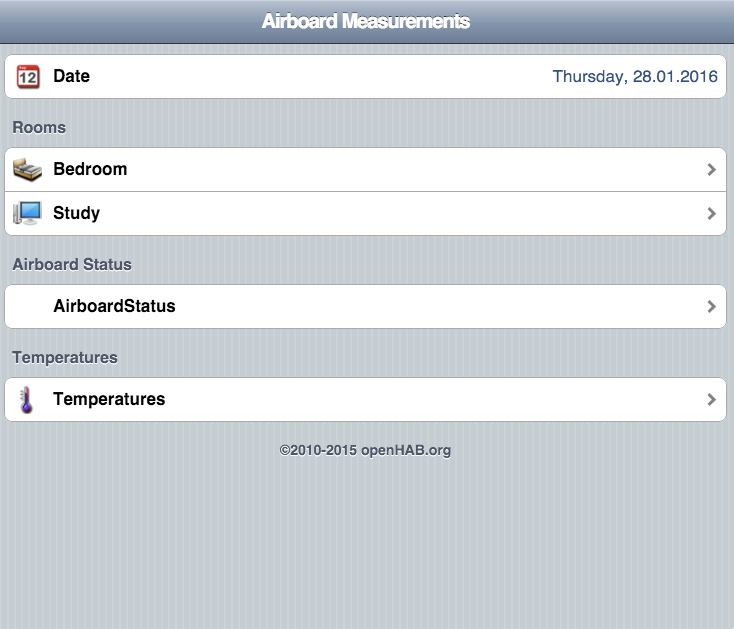

# The AirBoard WiFly Mqtt Publisher

MQTT publisher to support sending sensor data from [The AirBoard](http://theairboard.cc) via a [RN-XV WiFly Module] (https://www.sparkfun.com/products/10822).

Includes support for a [DHT22](http://www.freetronics.com.au/collections/modules/products/humidity-and-temperature-sensor-module) temperature/humidty sensor.

(Sorry for poor quality of images!!)

Requires the following libraries:
* TheAirBoard: https://github.com/theairboard/TheAirBoard
* WiFly: https://github.com/dpslwk/WiFly
* MQTT: https://github.com/knolleary/pubsubclient
* MemoryFree: https://github.com/maniacbug/MemoryFree
* dht, included in: https://github.com/RobTillaart/Arduino

Also include in the repository are [python scripts](extras/python) used to test the MQTT interface and an [OpenHAB](http://openhab.org) [configuration](extras/openhab) which provides an example of how the sensor data could be incorporated into a home automation environment.

The following images show the OpenHAB GUI

